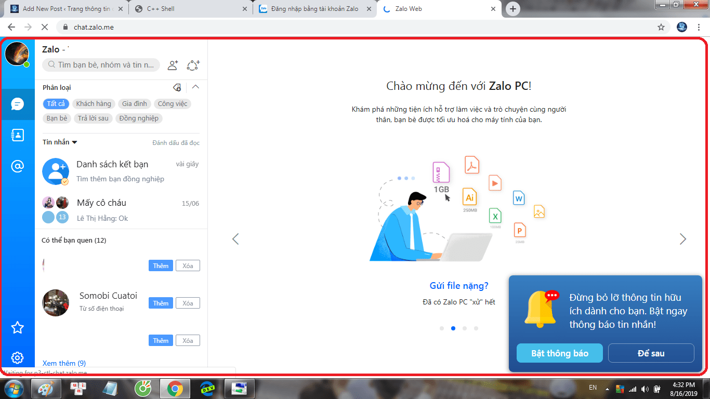
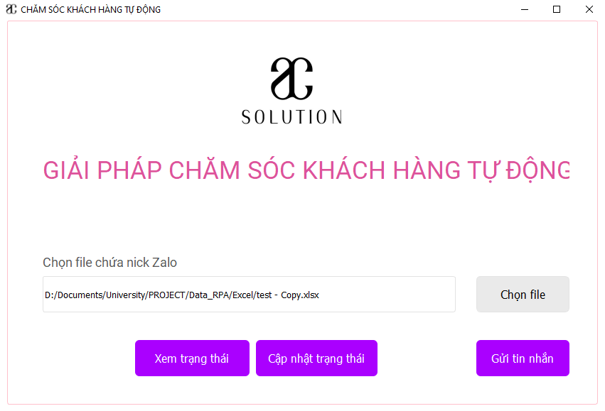
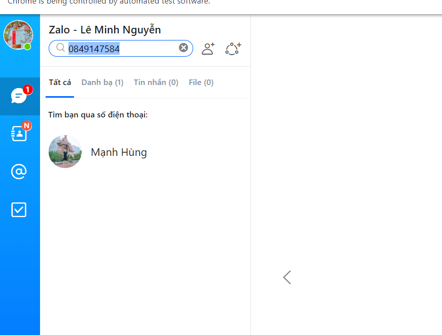
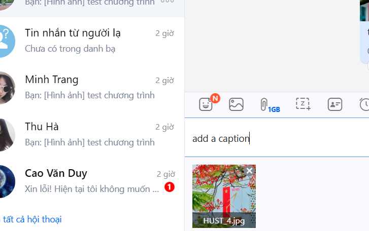
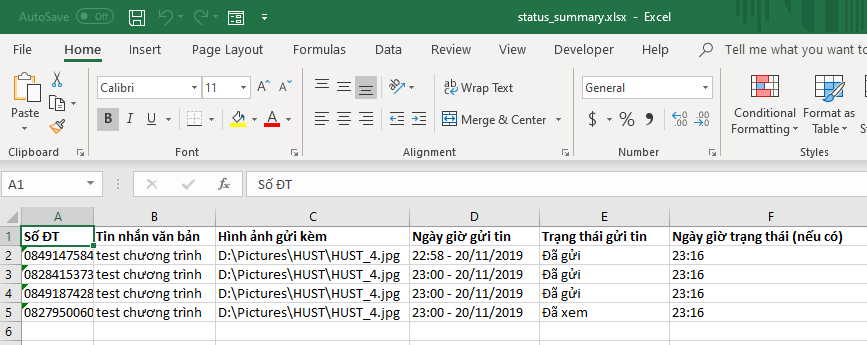

# RPA_BOT_CSKH (Overview)
Help to send messages and image to friends automatically in Zalo

## Introduce about Zalo:

Following on the lead of other “super apps,” Zalo has been 
integrating new functions into its app, including a payment 
platform called Zalo Pay, which was introduced last year.

Zalo is big application, also it supports for web platform. Zalo supports 
sending thousands of image, messages and paticularly you can send files up to 1 GB size

Zalo has became more popular in VietNam today because of usibility
, simple GUI, ...

### Some images about Zalo Web 

## Introduced about Zalo Bot CSKH

1. Problems
* Imagine you must send messages and images to dozens of your friends through Zalo,
 and them are the same.
* Boring, right ? You wondered and asked yourself a question whether can find a tool to automate the boring work.
The anwser is yes.

2. Solution
* Gain insight problems which many people are getting stucked, AC_SOLUTION company has played with the idea of 
creating a software to help people. And up here our product has been used by a hundred people, and we have recevied 
positive reactions. We hope this product will help in some boring works for you.
* The product not only helps you to send image and message but also gets status of messages sent
, the result will be export to excel including lots of useful information.
* And a interesting and special thing which the product brings to you is you only need to login for the first time
, from the second time you don't need to retype or remember password, our product has done it for you.
Exciting, right ?. So why don't use now.

### Some Images about RPA_BOT_CSKH

   

### 1. Find contact  

   

### 2. Contact found

   

### 3. Enter contact

   

### 4. Drag image

   

### 5. Add caption

   

### 6. Send combination of caption and image

   

### 7. Get status

## Contact us
AC-SOLUTION Company

Address:

Phone:  
 
 